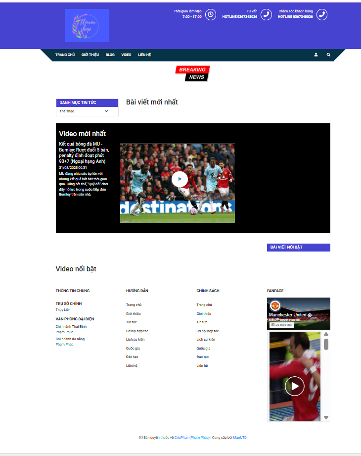
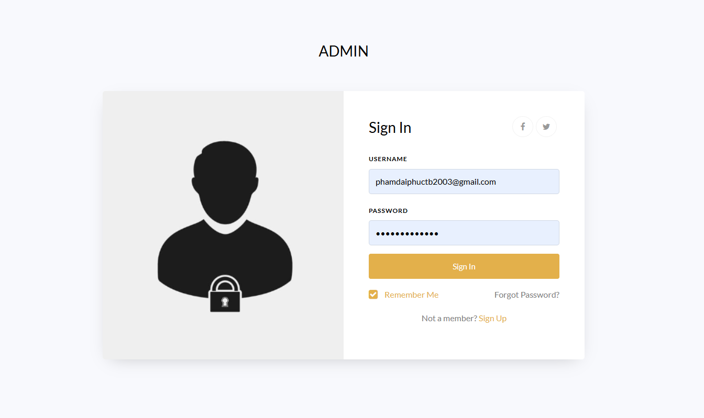
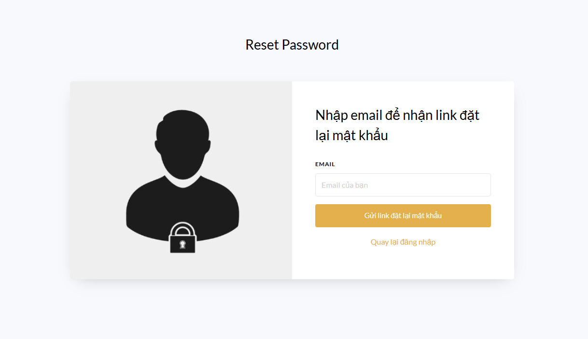
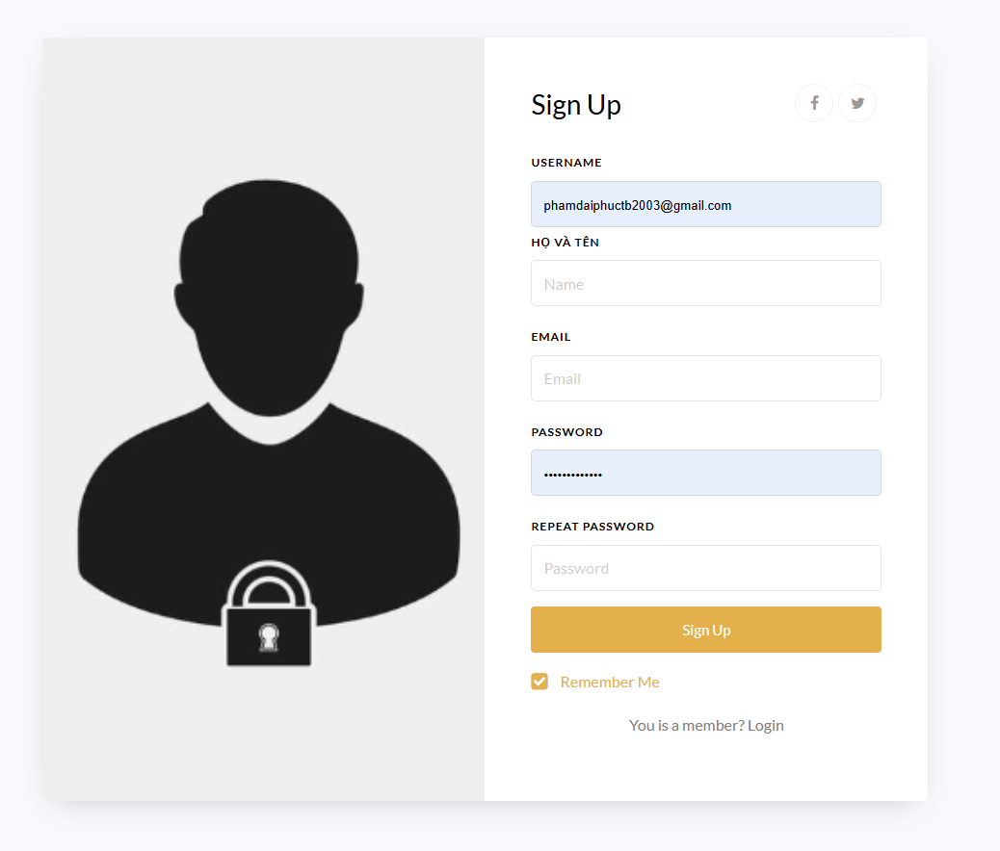
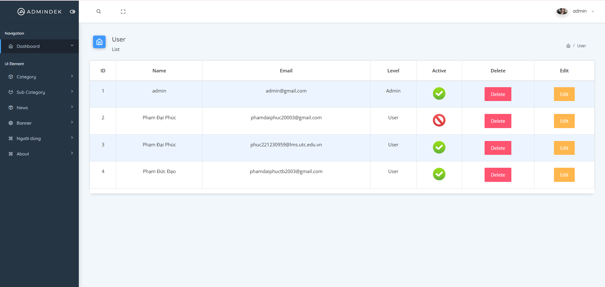
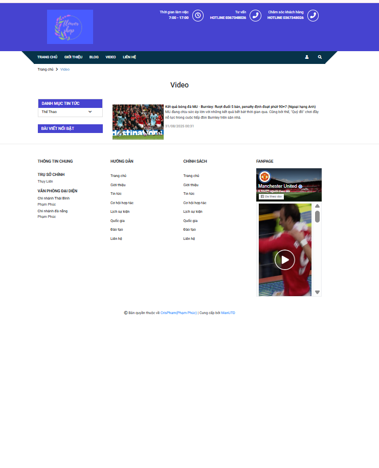
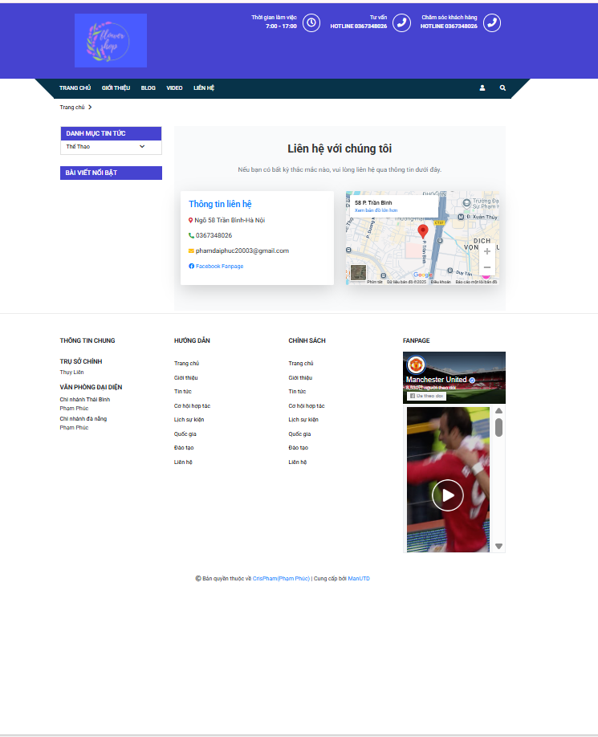

# 📰 Website Tin Tức

Dự án website tin tức được xây dựng với **Laravel + MySQL**, giao diện hiện đại, đầy đủ chức năng cho cả người dùng và quản trị viên.  

---

## 🚀 Chức năng chính

### 👤 Người dùng
- Xem video tin tức 📺  
- Đọc các bài viết mới nhất 📰  
- Đăng ký / Đăng nhập tài khoản 🔑  
- Reset mật khẩu khi quên 🔄  
- Bình luận dưới mỗi bài viết 💬  
- Xem Blog & Trang liên hệ ✉️  

### 👨‍💼 Quản trị viên (Admin)
- Thêm mới bài viết ✍️  
- Quản lý, chỉnh sửa, xóa bài viết 📑  
- Quản lý người dùng 👥  
- Xem và quản lý bình luận 💬  
- Quản lý banner quảng cáo 🖼️  
- Quản lý video tin tức 🎥  

---

## 📸 Giao diện

### 1️⃣ Trang chủ

### 2️⃣ Trang đăng nhập

### 3️⃣ Trang đăng ký

### 4️⃣ Reset mật khẩu

### 5️⃣ Sign Up

### 6️⃣ Trang Admin

### 7️⃣ Trang Video

### 8️⃣ Trang Blog

### 9️⃣ Trang Liên hệ

---

## 🛠️ Công nghệ sử dụng
- **Backend:** PHP (Laravel Framework)  
- **Frontend:** HTML, CSS, JavaScript  
- **Database:** MySQL  
## 👨‍💻 Tác giả
- **Tên:** Phúc  
- 📧 Email: phamdaiphuc20003@gmail.com  
